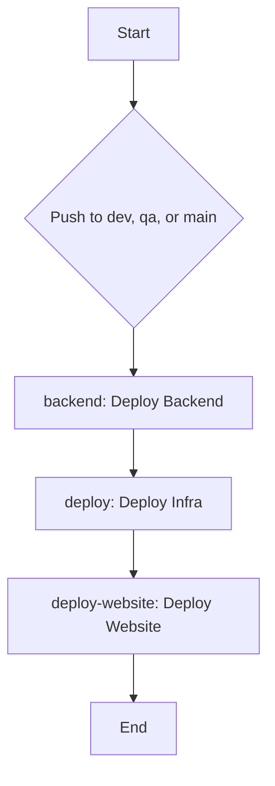

# IaC Azure Terraform Website

## What is this?

This repository contains the Terraform code to deploy a simple website on Azure. It's a "Hello World" of Infrastructure as Code, but with more YAML and less waving.

## How it works

The magic happens in the `.github/workflows/deploy.yaml` file. On a push to `dev`, `qa`, or `main`, a GitHub Actions workflow is triggered.

### The Workflow

Here's a little schema of what's going on under the hood:

### The Jobs

1.  **backend**: This job creates the Azure Storage Account and container that Terraform uses to store its state. It's like building the foundation before you build the house.
2.  **deploy**: This job runs `terraform apply` to create all the resources needed for the website (App Service Plan, Web App, etc.). This is where the real magic happens.
3.  **deploy-website**: This job deploys the actual website content to the Azure Web App. Because what's an infrastructure without a website to show off?

## How to use it

1.  Fork this repository.
2.  Create the following secrets in your repository:
    *   `AZURE_CLIENT_ID`
    *   `AZURE_TENANT_ID`
    *   `AZURE_SUBSCRIPTION_ID`
3.  Push a commit to the `dev`, `qa`, or `main` branch.
4.  Watch the GitHub Actions workflow run and deploy your website.
5.  Grab a coffee and relax. You've earned it.

## Contributing

Got a funnier README? A better Mermaid diagram? Feel free to open a pull request!
